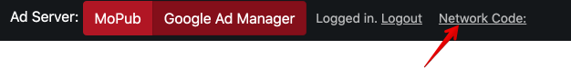

# How to Connect to Google Ad Manager

1\. Tap **Google Ad Manager** tab/segment in the top panel to switch to it.

2\. Tap **Log in** and log in into your Google Ad Manager account.

3\. Tap **Network code** 

and get a detailed instruction on how to obtain the network code, follow the instruction:

