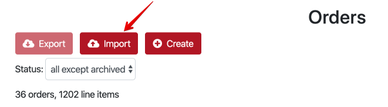
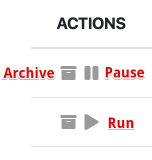

# Order Actions

## Export

1. Check the orders which you would like to export. Note: several orders can be exported in a single JSON file. 
2. Click the Export button.
3. After the export is finished choose the location to save the JSON file 

## Import

PubMonkey accepts orders in a JSON file in the same interemdiate format it exports them.
**Note**: the format for MoPub and GAM is different, thus cross-ad server import is not supported, you can only import the orders which were exported or generated for a specific ad server. 

1. Click the Import button.
2. Choose the JSON file from your local disk.
3. Wait for the import to complete and check your imported orders.

## Other actions

### Archive

Click the Archive button to archive the order.  Supported for both MoPub and GAM

### Pause

Click the Pause button to pause the running order.  Supported only for MoPub.

### Run

Click the Run button to run the paused order.  Supported only for MoPub.

