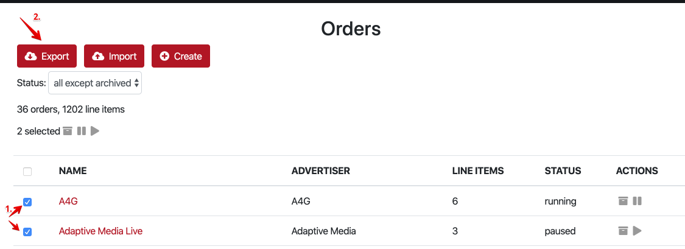

# Manage Orders

The below actions are available for the MoPub account.  GAM only supports order creation on the fly for now. 

## Export

1. Check the orders which you would like to export. Note: several orders can be exported in a single JSON file. 
2. Click the Export button.
3. After the export is finished choose the location to save the JSON file 

## Import

PubMonkey accepts orders in a JSON file in the same interemdiate format it exports them.
**Note**: the format for MoPub and GAM is different, thus cross-ad server import is not supported, you can only import the orders which were exported or generated for a specific ad server. 

1. Click the Import button.
2. Choose the JSON file from your local disk.
3. Wait for the import to complete and check your imported orders.

## Other actions

### Archive

Click the Archive button to archive the order.  Supported for both MoPub and GAM

### Pause

Click the Pause button to pause the running order.  Supported only for MoPub.

### Run

Click the Run button to run the paused order.  Supported only for MoPub.

# Generate Orders

## Generate a Prebid Order

Prebid Order generation is supported for both MoPub and GAM (Google Ad Manager). 

1. On the **Order** tab in PubMonkey click **CREATE** button.
2. As a **Header Bidding Service** choose "Prebid.org".
3. Name your Order.
4. Choose the appropriate **Granularity** - default is **auto**.
5. There are also common defaults specified for line items naming and keywords.  You may wish to change them according to your use case.
6. Creative Snippet is also editable and reflects a standard Universal Creative described [here](http://prebid.org/overview/prebid-universal-creative.html).
7. Choose the needed ad units below the creative. 
8. You are all set.  For MoPub you can download a JSON representation to import an order later, or you can hit "Create in MoPub" right away.  For GAM - just hit "Create in GAM".
9. For GAM you would also need to specify the Company - tap the **?** near that field to be taken to the Ad Manager page where you can create a Company.  

## Generate an Amazon TAM Order

TAM Order generation is supported for both MoPub and GAM (Google Ad Manager). 

1. On the **Order** tab in PubMonkey click **CREATE** button.
2. As a **Header Bidding Service** choose "Amazon Publisher Services (TAM)".
3. Name your Order.
4. For Amazon we have a uniform and non-uniform price granularity implemented, most likely - you have received a price grid from your account manager - so use non-uniform price granularity.
5. Copy and paste your price grid in the format shown in the **KV Pairs** placeholder field.  F.e. highlighting and copying from a CSV opened in Excel or Google Spreadsheet - usually results in a correct format of KV Pairs.  
6. Amazon Creative restricts the ad format, thus you have to choose the **Creative format**.
7. Choose the ad units filtered according to the chosen ad format. 
8. For GAM you would also need to specify the Company - tap the **?** near that field to be taken to the Ad Manager page where you can create a Company.  

## Other Orders

OpenX Apollo order generation is analogous to Prebid order generation. 

OpenX Apollo SDK for GAM is also analogous to Prebid except the creative uses app events. 

OpenX Apollo SDK for MoPub uses custom event classes.  

BidMachine order generation also uses app events for GAM and custom event classes for MoPub - please see BidMachine's integration instructions [here](https://doc.bidmachine.io/eng/ssp-publisher-integration-documentation/bidmachine-sdk-admanager-appevent-integration)
